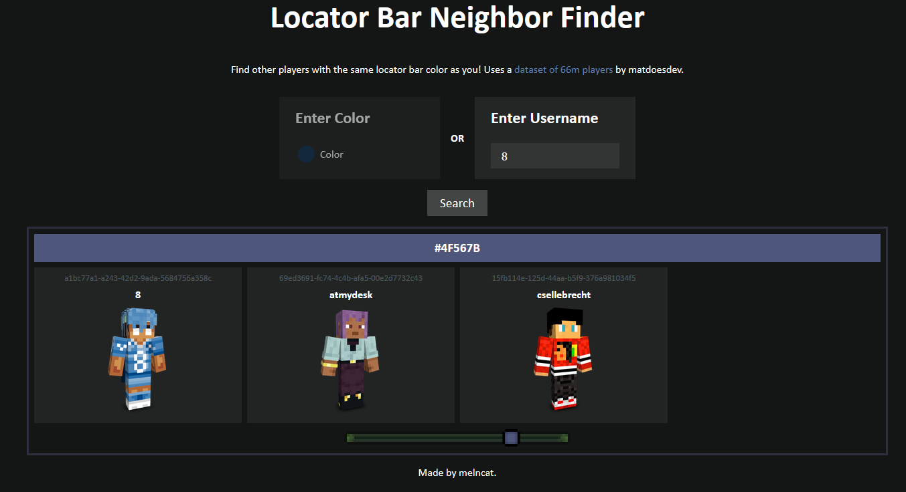

# Locator Bar Neighbor Finder

Hosted at https://locatorbar.crab.trade.

All players in Minecraft have their locator bar color determined based on their UUID.

There are 16.7 million colors, yet over 200 million Java edition players (I made this number up), 
so by the [pigeonhole principle](https://en.wikipedia.org/wiki/Pigeonhole_principle), at least one color
will have multiple players assigned to it. With so many players, chances are, there's multiple others with the exact same
locator bar color as you.

The server uses an empty database of players, so you'll have to populate it yourself. In my hosted server, I used https://archive.org/details/minecraft-uuids-2025-09-01 for 66 million usernames and their UUIDs. 

Also, you can search by both color and player, so if you want to find all people with #beef12 as their locator bar color, go ahead.

# Preview

yeah